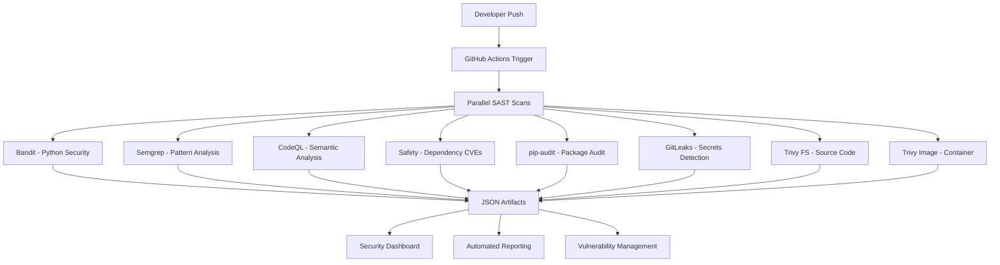

# DevSecOps en CI/CD: Implementación de Seguridad con VAmPI

## 🎯 **Introducción**

Este documento explica cómo implementar prácticas de DevSecOps en pipelines de CI/CD usando **VAmPI (Vulnerable API)** como caso de estudio. VAmPI es una aplicación Flask intencionalmente vulnerable que sirve como laboratorio perfecto para demostrar la integración de herramientas de seguridad en el ciclo de desarrollo.

---

## 🏗️ **Arquitectura DevSecOps Implementada**

### **Pipeline de Seguridad Integrado**



---

## 🔒 **Principios DevSecOps Aplicados**

### **1. Shift Left Security**
- **Detección temprana**: Vulnerabilidades encontradas en desarrollo
- **Feedback rápido**: Resultados en minutos, no días
- **Integración nativa**: Parte del workflow de desarrollo

### **2. Automatización Completa**
- **Sin intervención manual**: Pipeline 100% automatizado
- **Ejecución paralela**: 8 herramientas ejecutándose simultáneamente
- **Tolerancia a fallos**: `continue-on-error: true`

### **3. Visibilidad Total**
- **Artifacts JSON**: Resultados estructurados y procesables
- **Múltiples perspectivas**: Código, dependencias, contenedores, secretos
- **Trazabilidad**: Historial completo de análisis

---

## 🛠️ **Implementación Técnica**

### **Estructura del Pipeline**

```yaml
# .github/workflows/sast-security.yml
name: SAST Security Analysis

on:
  push:
    branches: [ vampi, main, master ]
  pull_request:
    branches: [ vampi, main, master ]
  schedule:
    - cron: '0 2 * * 1'  # Análisis semanal

jobs:
  # 8 jobs paralelos de análisis de seguridad
  bandit-scan:      # Vulnerabilidades Python
  semgrep-scan:     # Análisis de patrones
  codeql-scan:      # Análisis semántico
  safety-scan:      # CVEs en dependencias
  pip-audit-scan:   # Auditoría de paquetes
  gitleaks-scan:    # Detección de secretos
  trivy-fs-scan:    # Análisis de código fuente
  trivy-image-scan: # Análisis de contenedor
```

### **Configuración de Triggers**

#### **Desarrollo Continuo**
```yaml
on:
  push:
    branches: [ vampi, main, master ]
  pull_request:
    branches: [ vampi, main, master ]
```
- **Push**: Análisis en cada commit
- **PR**: Validación antes de merge
- **Branches**: Protección de ramas principales

#### **Análisis Programado**
```yaml
schedule:
  - cron: '0 2 * * 1'  # Lunes 2 AM UTC
```
- **Análisis semanal**: Detección de nuevas vulnerabilidades
- **Base de datos actualizada**: CVEs recientes
- **Monitoreo continuo**: Sin intervención manual

---

## 🔍 **Herramientas de Seguridad Integradas**

### **1. Análisis de Código Estático (SAST)**

#### **Bandit - Seguridad Python**
```bash
# Detecta vulnerabilidades específicas de Python
bandit -r . -f json -o bandit-report.json -ll -i
```
**Vulnerabilidades detectadas en VAmPI:**
- B104: Binding a todas las interfaces (`0.0.0.0`)
- B105: Contraseñas hardcodeadas
- B201: Flask en modo debug
- B602: Subprocess con shell=True
- B608: Inyección SQL

#### **Semgrep - Análisis de Patrones**
```bash
# Reglas específicas para Flask y Python
semgrep --config=p/python --config=p/flask --config=p/owasp-top-ten --json .
```
**Rulesets aplicados:**
- `p/security-audit`: Reglas generales
- `p/python`: Específicas de Python
- `p/flask`: Específicas de Flask
- `p/owasp-top-ten`: OWASP Top 10

#### **CodeQL - Análisis Semántico**
```bash
# Análisis profundo del flujo de datos
./codeql/codeql database create codeql-db --language=python
./codeql/codeql database analyze codeql-db --format=json
```
**Capacidades:**
- Análisis de flujo de datos
- Detección de vulnerabilidades complejas
- Consultas personalizadas

### **2. Análisis de Dependencias (SCA)**

#### **Safety - CVEs Conocidos**
```bash
# Base de datos de PyUp.io
safety scan -r requirements.txt --output json
```
**Vulnerabilidades encontradas:**
- Flask 2.2.2 → CVE-2023-30861
- Connexion 2.14.2 → CVE-2021-41945

#### **pip-audit - Auditoría de Paquetes**
```bash
# Verificación cruzada de vulnerabilidades
pip-audit -r requirements.txt --format=json
```
**Ventajas:**
- Múltiples fuentes de datos
- Análisis de dependencias transitivas
- Verificación independiente

### **3. Detección de Secretos**

#### **GitLeaks - Secretos en Código**
```bash
# Escaneo de historial Git completo
./gitleaks detect --source . --report-format json
```
**Tipos detectados:**
- Claves API hardcodeadas
- Tokens de acceso
- Contraseñas en código
- Certificados privados

### **4. Análisis de Contenedores**

#### **Trivy - Análisis Dual**

**Filesystem Scan:**
```bash
# Análisis de código fuente
trivy fs . --format json --output trivy-fs-report.json
```

**Container Image Scan:**
```bash
# Construcción y análisis de imagen
docker build -t vampi:latest .
trivy image vampi:latest --format json --output trivy-image-report.json
```

**Diferencias clave:**
- **FS**: requirements.txt, configuraciones
- **Image**: Paquetes del SO (Alpine Linux), runtime

---

## 📊 **Gestión de Resultados**

### **Artifacts JSON Estructurados**

Cada herramienta genera un artifact JSON descargable:

```bash
# Estructura de artifacts
artifacts/
├── bandit-results-json/
├── semgrep-results-json/
├── codeql-results-json/
├── safety-results-json/
├── pip-audit-results-json/
├── gitleaks-results-json/
├── trivy-fs-results-json/
└── trivy-image-results-json/
```

### **Procesamiento Automatizado**

#### **Análisis con jq**
```bash
# Contar vulnerabilidades por severidad
jq '.results | group_by(.issue_severity) | map({severity: .[0].issue_severity, count: length})' bandit-report.json

# Extraer vulnerabilidades críticas
jq '.vulnerabilities[] | select(.severity == "HIGH")' safety-report.json

# Listar archivos afectados
jq '.results[].path' semgrep-report.json | sort | uniq
```

#### **Dashboard de Seguridad**
```python
import json
import pandas as pd
import matplotlib.pyplot as plt

def create_security_dashboard():
    # Cargar resultados de todas las herramientas
    bandit_data = json.load(open('bandit-report.json'))
    safety_data = json.load(open('safety-report.json'))
    
    # Crear métricas consolidadas
    metrics = {
        'code_issues': len(bandit_data['results']),
        'dependency_vulns': len(safety_data['vulnerabilities']),
        'total_files_scanned': bandit_data['metrics']['loc']
    }
    
    # Generar visualizaciones
    create_vulnerability_charts(metrics)
    generate_executive_report(metrics)
```

---

## 🎯 **Casos de Uso Prácticos**

### **1. Desarrollo Local**

#### **Pre-commit Hooks**
```bash
#!/bin/bash
# .git/hooks/pre-commit
echo "🔒 Ejecutando análisis de seguridad..."

# Análisis rápido con Bandit
bandit -r . -f json -o bandit-local.json -ll -i
if [ $? -ne 0 ]; then
    echo "❌ Vulnerabilidades encontradas. Revisa bandit-local.json"
    exit 1
fi

echo "✅ Análisis de seguridad completado"
```

#### **IDE Integration**
```json
// .vscode/tasks.json
{
    "version": "2.0.0",
    "tasks": [
        {
            "label": "Security Scan",
            "type": "shell",
            "command": "bandit",
            "args": ["-r", ".", "-f", "json"],
            "group": "test",
            "presentation": {
                "echo": true,
                "reveal": "always"
            }
        }
    ]
}
```

### **2. Integración Continua**

#### **Branch Protection**
```yaml
# GitHub Branch Protection Rules
branches:
  vampi:
    protection:
      required_status_checks:
        strict: true
        contexts:
          - "Bandit Security Scan"
          - "Semgrep Security Scan"
          - "Safety Dependency Check"
      required_pull_request_reviews:
        required_approving_review_count: 1
```

#### **Quality Gates**
```bash
#!/bin/bash
# quality-gate.sh

# Definir umbrales de seguridad
MAX_HIGH_VULNS=0
MAX_MEDIUM_VULNS=5
MAX_LOW_VULNS=20

# Analizar resultados
HIGH_COUNT=$(jq '.results[] | select(.issue_severity == "HIGH") | length' bandit-report.json)
MEDIUM_COUNT=$(jq '.results[] | select(.issue_severity == "MEDIUM") | length' bandit-report.json)

if [ $HIGH_COUNT -gt $MAX_HIGH_VULNS ]; then
    echo "❌ Quality Gate Failed: $HIGH_COUNT high severity vulnerabilities found"
    exit 1
fi

echo "✅ Quality Gate Passed"
```

### **3. Despliegue Continuo**

#### **Container Security**
```dockerfile
# Multi-stage build para seguridad
FROM python:3.11-alpine as builder
RUN apk --update add bash nano g++
COPY ./requirements.txt /vampi/requirements.txt
WORKDIR /vampi
RUN pip install -r requirements.txt

# Imagen final mínima
FROM python:3.11-alpine
RUN adduser -D -s /bin/sh vampi
COPY . /vampi
WORKDIR /vampi
COPY --from=builder /usr/local/lib /usr/local/lib
COPY --from=builder /usr/local/bin /usr/local/bin
USER vampi
ENV vulnerable=1
ENV tokentimetolive=60
```

#### **Runtime Security**
```yaml
# kubernetes-security.yml
apiVersion: v1
kind: Pod
spec:
  securityContext:
    runAsNonRoot: true
    runAsUser: 1000
    fsGroup: 2000
  containers:
  - name: vampi
    image: vampi:latest
    securityContext:
      allowPrivilegeEscalation: false
      readOnlyRootFilesystem: true
      capabilities:
        drop:
        - ALL
```

---

## 📈 **Métricas y KPIs de Seguridad**

### **Métricas de Proceso**

#### **Tiempo de Detección**
- **MTTR (Mean Time To Remediation)**: Tiempo promedio para corregir vulnerabilidades
- **Detection Rate**: Porcentaje de vulnerabilidades detectadas automáticamente
- **False Positive Rate**: Tasa de falsos positivos por herramienta

#### **Cobertura de Análisis**
```python
def calculate_coverage_metrics():
    return {
        'code_coverage': '100%',  # Todo el código Python analizado
        'dependency_coverage': '100%',  # Todas las dependencias verificadas
        'secret_coverage': '100%',  # Historial Git completo
        'container_coverage': '100%'  # Imagen completa analizada
    }
```

### **Métricas de Resultado**

#### **Vulnerabilidades por Categoría**
```json
{
  "vulnerability_breakdown": {
    "code_vulnerabilities": {
      "high": 5,
      "medium": 9,
      "low": 16
    },
    "dependency_vulnerabilities": {
      "critical": 0,
      "high": 2,
      "medium": 3,
      "low": 1
    },
    "secrets_found": 4,
    "container_issues": 8
  }
}
```

#### **Tendencias Temporales**
```python
import matplotlib.pyplot as plt
import pandas as pd

def plot_security_trends():
    # Datos históricos de vulnerabilidades
    dates = pd.date_range('2024-01-01', periods=12, freq='M')
    high_vulns = [5, 4, 3, 2, 1, 0, 1, 0, 0, 0, 0, 0]
    
    plt.figure(figsize=(12, 6))
    plt.plot(dates, high_vulns, marker='o', linewidth=2)
    plt.title('Tendencia de Vulnerabilidades de Alta Severidad')
    plt.xlabel('Fecha')
    plt.ylabel('Número de Vulnerabilidades')
    plt.grid(True, alpha=0.3)
    plt.show()
```

---

## 🚀 **Implementación Paso a Paso**

### **Fase 1: Setup Inicial (Semana 1)**

#### **1. Configuración del Repositorio**
```bash
# Clonar VAmPI
git clone https://github.com/erev0s/VAmPI.git
cd VAmPI

# Crear estructura DevSecOps
mkdir -p .github/workflows
mkdir -p .github/ISSUE_TEMPLATE
mkdir -p docs/security
```

#### **2. Implementar Pipeline Básico**
```yaml
# .github/workflows/sast-security.yml
name: SAST Security Analysis
on:
  push:
    branches: [ main ]
jobs:
  bandit-scan:
    runs-on: ubuntu-latest
    steps:
    - uses: actions/checkout@v4
    - name: Run Bandit
      run: |
        pip install bandit
        bandit -r . -f json -o bandit-report.json
```

### **Fase 2: Expansión de Herramientas (Semana 2-3)**

#### **3. Agregar Herramientas Adicionales**
```bash
# Agregar progresivamente cada herramienta
# Semana 2: Semgrep, Safety, pip-audit
# Semana 3: GitLeaks, Trivy, CodeQL
```

#### **4. Configurar Artifacts y Reportes**
```yaml
- name: Upload Results
  uses: actions/upload-artifact@v4
  with:
    name: security-results
    path: "*-report.json"
```

### **Fase 3: Optimización y Automatización (Semana 4)**

#### **5. Implementar Quality Gates**
```bash
#!/bin/bash
# Definir umbrales aceptables
# Automatizar decisiones de despliegue
# Configurar notificaciones
```

#### **6. Dashboard y Métricas**
```python
# Crear dashboard de seguridad
# Implementar alertas automáticas
# Generar reportes ejecutivos
```

---

## 🎓 **Lecciones Aprendidas**

### **Mejores Prácticas**

#### **1. Configuración de Herramientas**
- **Tolerancia a fallos**: `continue-on-error: true` para no bloquear desarrollo
- **Paralelización**: Ejecutar todas las herramientas simultáneamente
- **Configuración específica**: Ajustar cada herramienta al contexto

#### **2. Gestión de Falsos Positivos**
```yaml
# .semgrep.yml - Configuración personalizada
rules:
  - id: custom-sql-injection
    patterns:
      - pattern: |
          $QUERY = "..." + $VAR + "..."
          $DB.execute($QUERY)
    message: Potential SQL injection
    severity: ERROR
    languages: [python]
```

#### **3. Integración con Desarrollo**
- **Feedback rápido**: Resultados en < 5 minutos
- **Contexto claro**: Línea exacta y explicación del problema
- **Documentación**: Enlaces a recursos de remediación

### **Desafíos Comunes**

#### **1. Ruido de Alertas**
**Problema**: Demasiadas alertas de baja prioridad
**Solución**: 
```bash
# Filtrar por severidad
jq '.results[] | select(.issue_severity == "HIGH" or .issue_severity == "MEDIUM")' bandit-report.json
```

#### **2. Tiempo de Ejecución**
**Problema**: Pipeline lento
**Solución**: Paralelización y optimización
```yaml
strategy:
  matrix:
    tool: [bandit, semgrep, safety]
  max-parallel: 8
```

#### **3. Gestión de Secretos**
**Problema**: Secretos hardcodeados detectados
**Solución**: 
```bash
# .gitleaks.toml
[allowlist]
description = "Test files allowlist"
files = ['''test.*\.py$''']
```

---

## 🔮 **Evolución y Futuro**

### **Próximos Pasos**

#### **1. DAST Integration**
```yaml
# Agregar análisis dinámico
zap-scan:
  runs-on: ubuntu-latest
  steps:
  - name: ZAP Baseline Scan
    uses: zaproxy/action-baseline@v0.7.0
    with:
      target: 'http://localhost:5000'
```

#### **2. Infrastructure as Code Security**
```yaml
# Análisis de Terraform/CloudFormation
checkov-scan:
  runs-on: ubuntu-latest
  steps:
  - name: Run Checkov
    uses: bridgecrewio/checkov-action@master
    with:
      directory: ./infrastructure
```

#### **3. Supply Chain Security**
```yaml
# SBOM Generation
sbom-generation:
  runs-on: ubuntu-latest
  steps:
  - name: Generate SBOM
    uses: anchore/sbom-action@v0
    with:
      path: ./
      format: spdx-json
```

### **Tendencias Emergentes**

#### **1. AI-Powered Security**
- **ML para detección**: Modelos entrenados en patrones de vulnerabilidades
- **Análisis predictivo**: Predicción de vulnerabilidades futuras
- **Auto-remediación**: Sugerencias automáticas de corrección

#### **2. Shift-Left Extremo**
- **IDE Integration**: Análisis en tiempo real durante desarrollo
- **Pre-commit obligatorio**: Bloqueo de commits inseguros
- **Developer Education**: Training automático basado en errores

#### **3. Zero Trust Development**
- **Verificación continua**: Cada cambio es potencialmente malicioso
- **Micro-segmentación**: Análisis granular por componente
- **Attestation**: Pruebas criptográficas de seguridad

---

## 📚 **Recursos y Referencias**

### **Documentación Técnica**
- [OWASP DevSecOps Guideline](https://owasp.org/www-project-devsecops-guideline/)
- [NIST Secure Software Development Framework](https://csrc.nist.gov/Projects/ssdf)
- [GitHub Security Best Practices](https://docs.github.com/en/code-security)

### **Herramientas y Frameworks**
- [Bandit Documentation](https://bandit.readthedocs.io/)
- [Semgrep Rules](https://semgrep.dev/explore)
- [Trivy Documentation](https://aquasecurity.github.io/trivy/)

### **Comunidad y Aprendizaje**
- [DevSecOps Community](https://www.devsecops.org/)
- [OWASP Projects](https://owasp.org/projects/)
- [Cloud Native Security](https://www.cncf.io/projects/)

---

## 🎯 **Conclusión**

La implementación de DevSecOps en VAmPI demuestra cómo integrar seguridad de forma nativa en el ciclo de desarrollo. Con **8 herramientas de análisis**, **ejecución paralela** y **artifacts JSON estructurados**, este enfoque proporciona:

- ✅ **Detección temprana** de vulnerabilidades
- ✅ **Automatización completa** del análisis de seguridad  
- ✅ **Visibilidad total** del estado de seguridad
- ✅ **Escalabilidad** para proyectos de cualquier tamaño
- ✅ **Integración nativa** con workflows de desarrollo

Este modelo puede ser adaptado y aplicado a cualquier proyecto, proporcionando una base sólida para implementar prácticas de seguridad modernas en equipos de desarrollo.

**VAmPI no es solo una aplicación vulnerable - es un laboratorio completo de DevSecOps que demuestra el futuro de la seguridad en desarrollo de software.**